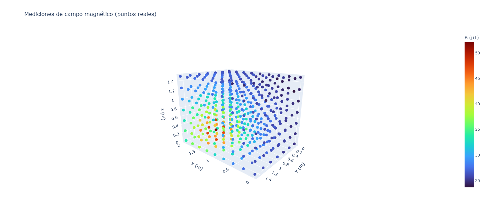
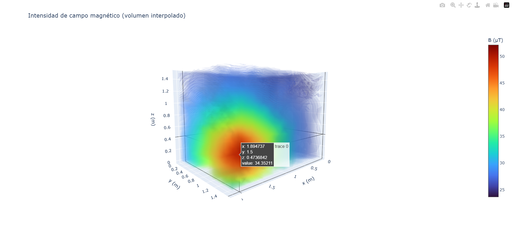

[English](README.md) | [Español](README.es.md)

# 3D Magnetic Field Intensity Map

Three-dimensional visualization of magnetic field intensity measured at
different points in a room. From pointwise measurements of the field
magnitude, the code generates:

1. A **3D scatter** of the raw measurements (no interpolation).
2. An **interpolated 3D volume** of the intensity.




Both are exported as interactive HTML files that open in the browser and
allow rotating, zooming, and inspecting values.

## Demostraciones interactivas

- [Volumen 3D interpolado](https://doloresirera.github.io/mapa-3D-campo-magnetico/ejemplo_campo_magnetico.html)
- [Mediciones reales (scatter 3D)](https://doloresirera.github.io/mapa-3D-campo-magnetico/ejemplo_puntos_mediciones.html)

## Context

Characterization of the ambient magnetic field in a paleomagnetism
laboratory, to identify zones of higher or lower intensity for the
handling of sensitive geological samples.

## Example data

The repository includes `datos_ejemplo.csv`, a **fictitious** set of 441
measurements generated over a regular grid (0.25 m spacing) with a
simulated magnetic source. It allows testing the code without real data.
The demonstration HTML files were generated from this file.

## Data format

The script expects a CSV with one row per measurement and these columns:

| Column | Meaning                        | Unit   |
|--------|--------------------------------|--------|
| `px`   | Position along the x axis      | meters |
| `py`   | Position along the y axis      | meters |
| `pz`   | Position along the z axis (height) | meters |
| `B`    | Magnetic field magnitude       | µT     |

Positions are measured from a fixed origin (a corner of the room); all
points must refer to the same origin and axes. Since only the field
magnitude is used, the sensor orientation at each measurement does not
affect the result.

## Usage

1. Install dependencies:
```
   pip install -r requirements.txt
```
2. Place the CSV in the same folder as the notebook and adjust the name
   in the `pd.read_csv(...)` line.
3. Run the cells in order.

Two HTML files are generated: one with the raw measurements and one with
the interpolated volume.

## Grid resolution

The number of output-grid nodes (the `np.linspace` lines) is not
arbitrary: as a reference, it is computed per axis as
**axis length ÷ measurement spacing**.

**Warning on over-interpolation:** increasing the number of nodes makes
the volume look smoother and more continuous, but beyond the real
sampling density that smoothness is interpolation, not measured data. The
demonstration HTML files in this repository use a denser grid than
strictly justified, only so the visualization looks clean. For real
analysis, keep the number of nodes appropriate to the sampling.

Note: the `surface_count` parameter (internal volume layers) is
different: it only changes how many isosurfaces are drawn over an
already-computed volume, and adds no interpolated data. Raising it does
not compromise validity, only appearance.

## Interpolation method

**Linear interpolation via Delaunay triangulation**
(`scipy.interpolate.griddata`, `method="linear"`) inside the convex hull
of the points. Optionally, border zones without data are filled using the
nearest neighboring point (`method="nearest"`).

**Limitation:** the border fill is extrapolation, not interpolation of
measured data, and should be interpreted with caution. To leave those
zones empty, comment out the `nearest` fill lines.

## Dependencies

- numpy
- pandas
- scipy
- plotly

## License

MIT
